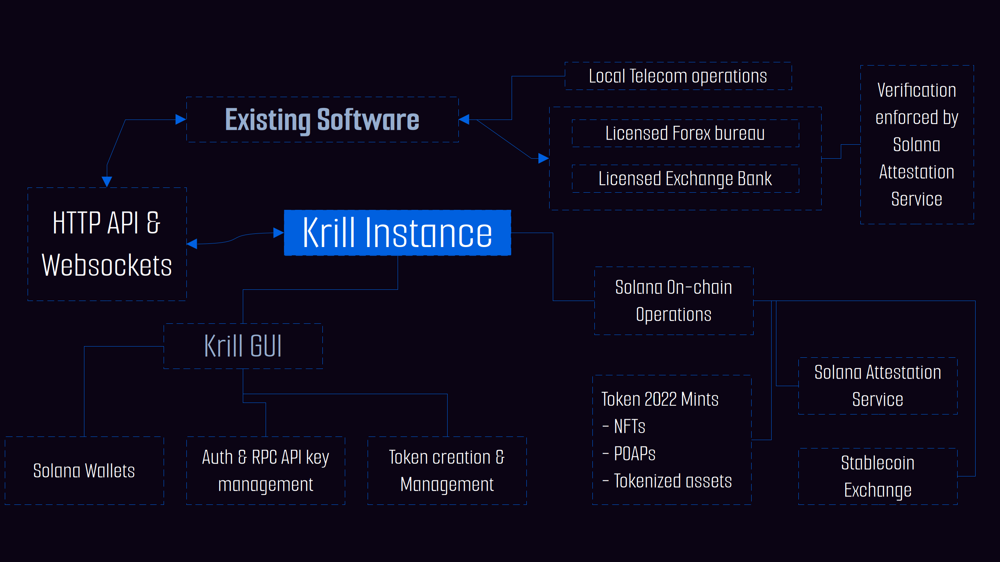
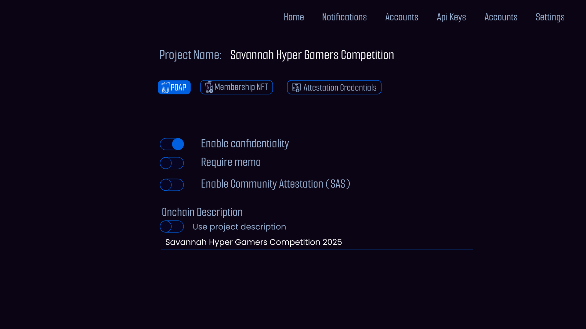
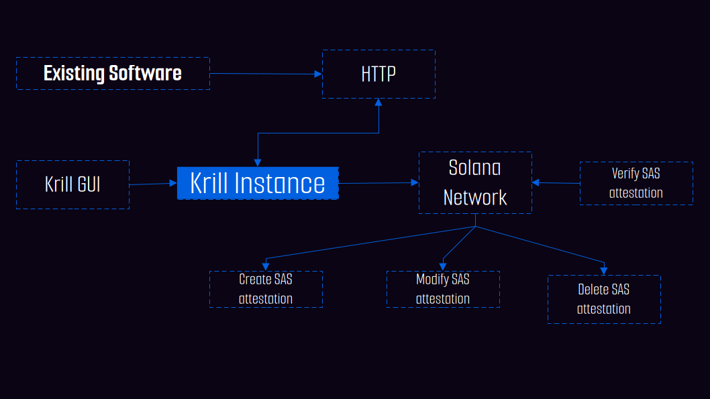
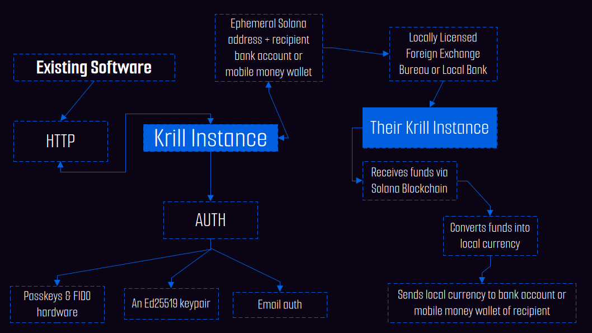
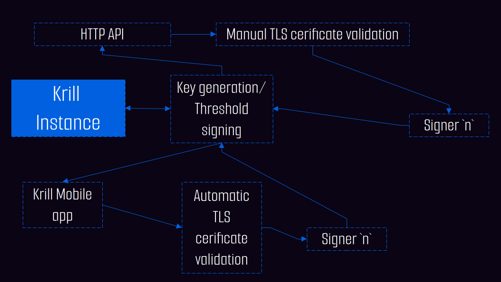

# Krill

### *POAPs, tokenization, onchain memberships and Monetary Exchange all controlled by you*

## Problem

### Overview

The current setup of blockchain ecosystem is a few large protocols trying to dominate token creation and foreign stablecoin exchange yet they cannot obtain licenses for each country and they cannot integrate their SaaS software with all the financial, legal and user management software in existence due to incompatibility, vendor lock-in and gate-keeping. 

Let’s look at a few scenarios.

#### Scenario 1

- Customers of a mini-mart/supermarket use Solana USDC to receive their salary. They ask the mini-mart to integrate Solana USDC so that they can spend anytime but the merchant only wants and supports local currency.
- The mini-mart uses Point-of-Sale (POS) software from vendor X that only supports local currency.
- To add Solana tokens and USDC payments to the POS, vendor X must acquire Solana and Rust knowledge
- Vendor X may also need to handle currency conversion between stablecoins and local currency via a licensed local forex exchange bureau or bank.
- The mini-mart can replace vendor X’s POS software and hardware with a Solana-specific global POS but this is costly, especially in weaker currency markets and requires shipping and setup costs.
- If vendor X’s POS provides advanced features like stock control, checkout, SMS payment updates, USSD, and loyalty cards, the mini-mart faces high switching costs if they are to find POS software with the same features but also Solana support. The most likely outcome is avoiding Solana integration entirely.

#### Scenario 2

- A gaming community has off the shelve open source community management software they use to manage membership and send out rewards from their web UI. 

- The community wants to expand it’s membership to multiple regional countries.

- They decide that the best way to do this is to use Solana blockchain so that they can issue soul-bound NFTs for membership, POAPs for each competition ticket and distribute competition rewards via USDC to the winners.

- For each region, there exists a licensed remittance company that supports multiple stablecoins that can convert the funds to local currency and send the funds to mobile money wallets or bank accounts.

- The gaming community would need to hire a developer to write code for soul-bound NFTs, POAPs, handling wallets and SOL transaction payments in a manner that is compatible with the community management software they have.

- This assumes the developer already has knowledge of Rust and Solana domain specific knowledge.

#### Scenario 3

A real-estate agent wants to to tokenize rent yield by raising funds for construction and interior furnishing of apartments under construction. They get a partial loan from a local bank to cover some costs.

The real-estate agent wants to raise the rest via blockchain since they can quickly obtain capital especially from citizens from the diaspora without going through intermediaries.

The real-estate agent chooses Solana to reduce cost due to it’s low fees and to eliminate middle-men who take 2% transaction fee.

However, the real-estate agent faces the same issues:

- integration with their current real estate software
- construction suppliers and employees receiving payments in local currency
- licensing requirements for the currency exchange institution
- AML/KYC compliance
- How does the bank act as the credential attestation and guarantor for legal compliance

### Common issues

All these scenarios have the same recurring issues:

- High acquisition costs for communities, small and medium enterprises
- Users cannot leverage existing local licensed and trusted institutions like banks to prove their identity to onchain users via some form of attestation
- Developers require knowledge of Rust and Solana domain
- Incompatible software architecture and potential gate-keeping by current software vendors
- AML/KYC and licensing requirements for monetary exchange from governments. Some countries even require different licenses for different scenarios
- Integration with current software especially where a particular vendor has advanced solutions tailored for a certain market or service or telcos.
- Existing integrations with certain local providers make skipping current Solana specific software providers the only option since it’s impossible to customize subscription software for all the businesses in the world. 

### More Example usecases

- Legal documents attestation
- Membership for blockchain communities
- Events POAPs
- Supply chain audits
- Tokenized assets
- Digital royalties (art, music, video etc)
- subscriptions via onchain identities that can be used on any subscription platform
- Influencers earning in foreign stablecoins and receiving funds in local currency
- Onchain competitions
- Onchain Rewards distribution 
- Global coupons and discounts with for example shipping partnets
- Receiving foreign stablecoins to a local bank account or mobile money wallet via a locally licensed bank or forex exchange bureau
- Tokenized yield earning assets guaranteed by a local licensed bank or investment institution
- Crowd funding
- and many more....

## Learning from the best: WordPress & HTTP

WordPress powers 100+ million websites helping thousands of small and medium businesses cut costs by eliminating the need for expensive custom websites. 

It’s open core has resulted in a vast library of themes and plugins for various integrations in e-commerce and payments without the users paying for custom development and expensive maintenance. It’s HTTP APIs make it easy to extend it using any programming language. 

This project aims to replicate that by providing and open source platform that can be adopted into existing software making it easy to do Solana onchain operations while enforcing regulatory compliance. This accelerates adoption of distributed ledger technology without being tied down by incompatible vendor software or uncertain legal compliance of global companies and provides an easy path for software vendors who might reject adopting blockchain technology because it requires to buy subscriptions to existing Solana vendors.

***Using these success case studies, this project aims to provide 5 key components to make adoption as easy as possible:***

1. Provide a standalone easy to configure server with sane defaults that can serve HTTP & WebSocket requests/responses between the server and existing software.
2. A Web GUI for configuration of the server, creating attestation credentials, API key management and Solana account management with multi-signature support.
3. User-friendly creator tools for POAPs, Soul-bound membership NFTs, rewards distribution, tokenization of assets with simple rules and ephemeral accounts that can be used to receive foreign stablecoins that can be exchanged by a licensed entity with local compliance licenses (for example a forex bureau running another instance of the software that is integrated via HTTP to APIs of local banks or mobile money wallets in a way that allows the intended recipient to receive the funds in local currency)
4. Inbuilt authentication via email, WebAuthn (passkeys & other FIDO hardware) and multi-signatures ([FROST using distributed key generation](https://frost.zfnd.org/tutorial/dkg.html) and a mobile app for Solana mobile dapp store that adds easy passkey and multi-signature authentication and authorization of server configurations. They can also view membership NFTs and POAPs in case users don't want to install an external wallet just to view them if they already have the app installed.
5. A voting module to enable member voting within the onchain community (can work offchain too if the server is a trusted authority)
6. An attestation that allows users to request attestations


> 
>
> A  simple overview of the Krill server and how it fits into an existing software service

To make token creation user-friendly, the GUI provides categories for various tokens so that a user doesn't need to know technical names for token extensions just to create mints and also provides security guarantees for each category.

>
>
>From this GUI example a user can choose to create a Proof-of-Attendance (POAP) for a regional gaming competition, enable confidential mints, enable required memo extension and community attestation by clicking a switch (button). The server handles building, signing (multi-signature or not) and sending the transaction; all optimized for efficient compute units usage.

The `Attestation Credetials` are generated in the settings and are stored onchain where a participant can attest they are part of the gaming community.

Using such simple interfaces allows developers or a business to focus on their growth instead of facing rising costs and difficulties acquiring domain specific knowledge.

### Token categories

1. **Membership NFTs**

   These NFTs prove membership of a user and can be attached to an attestation by pointing the mint account to the attestation service account created by the server. They can be made confidential, are soul-bound but can be revoked when membership is lost. These can also require a user to interact with the server first via inbuilt transfer hooks extension module for example where a user ID or other credentials are required for a particular organization to be compliant with the law.

2. **POAPs**

   These are Soul-bound NFTs that prove the attendance to a certain event. They can be made confidential and tied to an attestation like the membership NFTs but unlike membership NFTs they cannot be revoked.

3. **Digital Rights Management**

   This can be music, art, video content and support loyalty collection

4. **Customer loyalty**

   This is useful especially for projects that want to award points to their customers for spending onchain funds

5. **Legal identity and compliance attestation**

   Through the GUI or app, an organization can create a digital attestation using the Solana Attestation Service (SAS) and then use that to issue digital identities that are verifiable onchain. For example, a member of a local trusted bank with online SAS credentials can use their identity to raise capital from investors. The investors can simply check if the address has a valid attestation and if the bank can act as a guarantor, the investor can choose to invest or not. This is not the same as membership NFT. In some legal scenarios, a simple attestation by a legal representative is required and the legal representative can give a digital attestation for that particular scenario.

6. **Yield bearing investment tokens**

   This are especially useful for tokenized assets and would use the yield bearing token extension

7. **Tokenized on-off assets**

   This module is available for assets that don't earn any yield

8. **Crowd funding**

   Used to raise funds. It combines POAPs, identity verification/attestation and confidential mints

9. **Limited-edition merchandise**

   These are part of a collection unlike other NFTs that can be

10. **Certification**

    This allows attestation of various goods or services via a trusted institution. This includes examples like a diploma, luxury goods like jewels or supply chains warranties, service contracts or ethical mining of minerals. 

11. **Subscription management and access keys**

    A digital publisher can give access to a buyer or subscriber access keys to their content and they can read that content legally from any platform using universal keys. Another example is a subscription magazine that can give global access keys to readers of certain regions by issuing keys to a certain community.

12. **Global  limited time only coupons or discount vouchers for goods and services**

    Tokens issued globally for access to certain products for example an onchain community can partner with a certain manufacturer to issue coupons or shipping discounts that can be redeemed up purchase.

These 12 categories cover a lot of communities, small and medium enterprises that have minimal resources to spend on expanding their services to distributed ledger technology. Grouping them into categories also gives security guarantees about how a token should work for each category during mint creation, minting tokens and burning tokens. Utilizing the Solana token extensions allows additional security guarantees enforced by the SVM runtime.

### Attestation Services

The Solana Attestation Service will be used to verify identities of community/institutions and their members. All operations can be initiated via HTTP or GUI.

> 
>
> Illustration of the attestation service creation, modification, verification and deletion

### Onchain deposits and account management

The current method of receiving stablecoins either requires a licensed global money remittance platform (which takes about 2% fees) or peer-to-peer exchanges which can be error prone especially for businesses.

Instead of bypassing the current global financial system, Krill software supplements it. Users are already used to exchanging foreign currency via a forex bureau or local bank. Krill instance can generate ephemeral keypairs for use in a Solana transaction whose end result is the intended recipient receiving a stablecoin into their bank account or mobile money wallet in their local currency. 

> 
>
> How the two Krill instances can operate to efficiently enable the recipient to receive local currency into their mobile money wallet or bank account. Each Krill instance can be extended via HTTP calls to support APIs for local banks and telecoms for mobile money


### Voting

A Krill also supports off-chain and onchain voting. Users can cast their vote using email, the mobile app or by login in to a Krill instance via their credentials. The Krill instance handles publishing and tallying the results onchain.


### Multi-signatures

A Krill instance can handle multi-signatures provided by Ed25519 keypairs, FROST Ed25519 signatures, passkeys or any FIDO2 hardware module that supports WebAuthn. The mobile app can provide easy generation and storage of FROST Ed25519 distributed key generation and signing where Ed25519 signatures are required since passkey adoption of Ed25519 is not well supported.

### Transaction signing and long-term account and mint rent management

Krill instances cannot be trusted to always work honestly especially on cloud computing platforms. While support for confidential computing (AMD SEV-SNP & Intel TDX chips) is improving, it still costs a lot and these additional cost would be passed on to the users.

For users who would be burdened by these costs, [Frost Ed25519](https://frost.zfnd.org/tutorial/dkg.html) distributed key generation would be used to ensure that all parties agree to spend the SOL before the Krill instance sends the transaction onchain. Users of the mobile app have an additional layer of security by using their biometrics to login and authenticate to the app to perform distributed key generation and threshold signing. The benefit of this is that the Solana blockchain only sees one signature despite it being a aggregate of multiple signatures. This also doesn't reveal the number of required signers to the outside world improving privacy.


## Specification

This section goes in depth into the API specification for the HTTP & Websocket APIs, supported tokens, authentication, building and sending transactions.

### Secure connections

HTTPS is enabled by default. Only TLS 1.3 is supported for better security with the following cipher suites:

```
CHACHA20_POLY1305_SHA256
AES_256_GCM_SHA384
AES_128_GCM_SHA256
```

### Krill Server configuration and initialization

#### 1. Secure HTTPS admin login

The Krill instance is initialized on a server where TLS configuration has been performed and will look for the TLS certificate and key in the `/etc/letsencrypt` directory which is a sane default for the target user. A user via SSH or some initialization script starts the server:
```sh
krill --domain foo.bar --temp-password 12345678
```

This starts the krill instance looks for the certificate for domain `foo.bar` in the `/etc/letsencrypt` directory and sets the initial temporary admin password to `12345678` . This ensures the server configuration can be set securely from the GUI or HTTP API. A `--certs` argument can be passed to specify a different directory where TLS certificates are stored.

Once this has started the configuration can be performed via HTTP authentication as specified in the HTTP API section. For the first HTTP request for login with the temporaty password, the HTTP header would contain:
```sh
Authorization: Bearer <temp password> 
```

Once the configuration is completed the return body contains the an authorization token for future requests:

```json
{
    "status": 200,
    "authorization_token": "<the authorization token>",
    "expiry": <unix timestamp>,
    "certs": <TLS certs directory used>,
    "domain": <the domain name that was configured>
    "tls_port_online": <boolean that describes whether the server is listening at port 443 for TLS>,
    "configuration": <instituion configuration as described in the next session>,
    "threshold": <the number of signatures required to approve operations like configuration changes and spending operations>
}
```

The `expiry` can be used by the client to request a new bearer token. `expiry` is also configurable from the settings.

Data structures:

`status`: String
`authorization_token`: String
`expiry`: u64 
`certs`: String
`domain`: String
`tls_port_online`: boolean
`configuration`: ***See the next section's response body***

#### 2. Institution or community information configuration

This is the second state of the Krill instance which configures the following:

- The email of the authority
- The passkeys or WebAuthn FIDO hardware for authentication & authorization
- Other authority details for threshold signing. The details for login are simplified by being sent via email or scanning a QR code displayed on the interface in case the authorities are seeing the same interface.
- Email SMTP logins for email operations
- The Solana RPC API key to use 
- The authority password that encrypts the database. This can be a threshold shamir secret
- An optional directory or network to store encrypted backups. (The apps can also pull and store backups especially when sensitive configuration has been changed or updated).
- The optional configuration for Solana Attestation Service (SAS). If a multi-sig is required this initiates it and waits for other authorities sign up to the service asynchronously
- The Solana wallet that holds SOL for onchain operations. If this is a multi-sig then the process is initiated and waits asynchronously for the other authorities to sign up.

**The HTTP request**

This is the request body sent by section 1 if the user wishes to configure the server via HTTP instead of GUI.

```json
{
    "authorities": [<string of authorities emails, note at least one is required>],
    "email": ["SMTP username", "SMTP password"],
    "rpc_api_key": <optional Solana RPC APIKEY, if none assumes API key is part of URL>,
    "rpc_url": <URL to Solana RPC, may or may not contain API key>,
    "identifier": <The name of the institution or community>,
	"shortened_identifier": <The shortened name of the name of the instituion above>,
    "logo": <base64 encoded image bytes for the logo>,
    "icon": <base64 encoded image bytes for the logo icon; can be used in previews and as a favicon>
}
```

Data structures for the request:
`authorities`: Array of Strings
`email`: An array of two Strings, the username and password
`rpc_api_key`: String
`rpc_url`: String
`identifier`: String
`shortened_identifier`: String
`logo`: String (base64 encoded)
`icon`: String (base64 encoded)


**The HTTP response**

The status code is omited here since this body is part of the previous section.

```json
{
    "awaiting_auth": {
        "message": "The authorization requests have been sent to authorities via email. Ask them to check their emails.",
        "queue": [<array of authority's emails>],
    },
 	"identifier": <The name of the institution or community>,
	"shortened_identifier": <The shortened name of the name of the instituion above>,
}
```

### Authentication & Authorization

Once the authority authentication emails are sent, the one-time codes within the email can be used to validate them for any updates of 2FA required on transaction requests. 

After an authority is authenticated they can create their passkey or WebAuthn token from within the same web UI view if they want that instead of 2FA via email. For users who want regular Solana Ed25519 authentication, the same web UI support the wallet-adapter standard. For users who want multi-signature using Ed25519 FROST signing using distributed key generation, they can scan a QR code from the app for easy management. FROST has the privacy benefit of appearing onchain as a single authorizing signature; it doesn't show the required threshold of a signature.

This part does not support HTTP request for Sign In With Solana, passkeys or any WebAuthn supported hardware. Plain Ed25519 keys and FROST Ed25519 keys are supported via HTTP is the software is able to implement them, but for simplicity authentication is always available in the app.

The Ed25519 keys for the administrator hold SOL for onchain operations while user specific ones can be used for SIWS or other onchain operations.

#### Multi-Signatures with FROST

The Krill instance does not live onchain. This opens up certain possibilities like FROST distributed key generation & signing. 

> FROST is a threshold signature scheme. It allows splitting a Schnorr signing key into `n` shares for a threshold `t`, such that `t` (or more) participants can together generate a signature that can be validated by the corresponding verifying key. One important aspect is that the resulting signature is indistinguishable from a non-threshold signature from the point of view of signature verifiers.
>
> [https://frost.zfnd.org/frost.html](https://frost.zfnd.org/frost.html)

Frost supports [Ed25519](https://crates.io/crates/frost-ed25519) and [Secp256r1](https://crates.io/crates/frost-p256) signatures both of which are supported by the Solana blockchain. It's integration in Krill allows for one Solana signature for onchain operations but with `n` threshold signatures that verify the transaction before signing. The Krill instance GUI, HTTP API and app all allow deserializing a transaction to show the end result so that each user knows what they are signing.

The implementation of FROST in Krill uses the [distributed key generation](https://frost.zfnd.org/tutorial/dkg.html) mode over HTTPS. In case of a client using HTTP API, that client is responsible for verifying the authenticity of the certificates. If a user is using the app, the app automatically verifies this and notifies them of invalid TLS certificates or expired ones and disables any key generation or signing option. 

> 
>
> TLS verification during a FROST key generation or threshold signing operaion

#### SIWS

Sign In With Solana (SIWS) is also supported for each user when using the Krill interface.

### Attestation Credentials

The attestation credentials are required for compliance. The WebUI provides an interface for simple configuration of attestations by an organization. Email notifications and app notifications for this are provided where threshold signature is required for approval and to perform onchain operations.

```json
{
    "config": {
        "credential_name": <name of the credential especially organization name>,
        "schema_name": <name of the schema that describes the structure of the credential>,
        "schema_version": <one byte describing the version>,
        "schema_description": <the description of the schema>,
        "schema_layout": <an array of bytes describing the schema layout>,
        "schema_fields": <the human-readable field names that will be stored in our attestation>,
        "expiry": <a timestamp when the attestation will expire>
    }
}
```

Data types:

`credential_name`: String
`schema_name`: String
`schema_version`: one byte (u8)
`schema_description`: String
`schema_layout`: An array of bytes that describe the data store as defined in the [SAS guide](https://attest.solana.com/docs/schemas#schema-layout-data-types)
`schema_fields`: An array of Strings
`expiry`: i64

The Web GUI if used provides a calendar for easy date expiry selection. The Krill instance creates the schema, adds the fields and performs all onchain operations required create, modify and delete the attestation and associated program derived accounts. The app also contains default programs that verify the signing request for the transaction is to the valid programs.

### Token categories construction

All tokens contain the following extensions:

1. Metadata
2. Metadata Pointer
3. Pausible

These extensions ensure that each mint has metadata information that gives a description of a mint. Something required for legal compliance. The `pausible` extension allows pausing all activity on a mint in case this is required. This is useful not just during a security breach but also when a court order demands minting stops until a certain ruling is made on a project.

All tokens also optionally point to an attestation account showing the legal compliance of an institution or community. The Solana Attestation Service is used for this.

For transfer hooks token extension, the Krill instance manages this by providing callback URLs or calling external callback URLs.

#### Membership NFTs

Constructed using the following token extensions on mints and ATAs:

1. CPI guard extension prohibiting CPI actions unless the authority approves. In a threshold signing scheme more eyeballs make this more difficult to do.
2. Immutable owner extension
3. Non-transferable extension
4. Permanent Delegate since the community can revoke membership for example in fraud cases, limited time memberships or violation of code of conduct.
5. Optional Confidential extension where the tokens can be made public or not. The key generation for encryption and decryption is also handled by the Krill server.  The keys are immutable for each token and can be attached to an email or download file so that the owner of the token can always decrypt it even when they loose membership, an event ends and a token mint is destroyed or when they need to decrypt it for legally compliance.

The membership NFTs are also linked to the community attestation account.

The app, GUI and HTTP can be queried to show the information on an NFT since Krill instance provides deserialization of the mint data and all extensions part of the mint

#### POAPs

1. CPI guard extension prohibiting CPI actions unless the authority approves. 
2. Immutable owner extension
3. Non-transferable extension

The Solana Attestation is also attached ensuring that the POAP always shows who created an event and issued the POAP.

Unlike the membership NFT, the POAP can never be revoked and does not contain a permanent delegate or any other extensions like transfer hooks that require a verifier to interact with a service.

#### Digital Rights Management, Yield bearing investment tokens and Subscription management and access keys

The token groups share similarities and similar token extensions are used to turn certain features on and off. The token extensions used are:

1. CPI guard
2. Immutable owner
3. Non-transferable
4. Transfer hooks (the Krill GUI provides configuration for this for some scenarios)
5. Transfer fees. This also allows an intermediary to collect fees; for example a bank financing the tokenization of assets

#### Customer loyalty, Limited-edition merchandise and Global  limited time only coupons or discount vouchers for goods and services

These token groups have the following optional token extensions:

1. non-transferable 
2. group and group pointer
3. transfer hooks
4. permanent delegate
5. immutable owner

#### Crowd funding

This token category is used to raise funds. It combines POAPs category described above, identity verification/attestation and confidential mints showing who participated. POAPs and confidential extensions are optional but attestation is required to prove the identity of the organizer. A forex exchange bureau or bank using Krill software or another wallet can be attached to receive and exchange the funds in local currency.

#### Tokenized on-off assets

Some assets can be sold once and forgotten. This module ensures transfer to the right owner and fees is collected by using the token extensions:

1. optional transfer fees
2. optional transfer hooks
3. optional group extension & group pointer if it is a collection

#### Legal identity and compliance attestation

It combines SAS service with a commitment. The commitment is just a HMAC of the compliance information. The schema describes how to deserialization the information. Krill server generates an ephemeral key it uses for HMAC and attaches the key to an email or download file for easy retrieval. Using a HMAC ensures the preimage is not easy to guess since the hash is on the blockchain.

#### Certification

Certification extends the Legal identity and compliance attestation category described above but adds support for supply chain QR codes, barcodes or any other data. These fields can be described under SAS schema.

### Stable coins to local currency module

This is a simple module that allows a bank or foreign exchange bureau (intermediary) to receive stablecoins on behalf of a recipient. The allows the intermediary to exchange global stablecoins to local currency and immediately send the funds to a recipient's bank account.

The flow is simple, a Krill instance is used to create an ephemeral/static address for receiving the stablecoins on the Solana blockchain. On receiving the funds the Krill instance sends a request to the intermediary with the recipient's mobile money wallet or bank account details offchain and the Solana address that will spend the stablecoins. When the intermediary (they could be running another Krill instance) receives the request, it responds whether it can process the request or not. If it can, the Krill instance sends the funds to the intermediary and the intermediary sends the funds to the mobile money wallet. 

This module allows current financial infrastructure and regulatory compliance to frameworks to be used together with distributed ledger technology with minimal hurdles.

### User management

This is a large module. It manages:

1.  the authorities of the server (create, read, update, delete)
2.  manages community members (create, read, update, delete)
3. manages logins via Solana SIWS
4. Allows each user to use the wallet-standard `connect`, `disconnect`, `signMessage`, `signTransaction` and `signAndSendTransactions` while only using passkeys, FIDO2 hardware or FROST threshold signing. This improves the user experience where user don't want to manage Ed25519 keypairs.
5. Manages threshold signing for requests for identity verification using Solana Attestation Service especially for one-off.
6. Allows points 1,2 and 5 to be managed via HTTP and the app.

### Backups

This modules provides automated encrypted (threshold shamir secret sharing) backups to a specified IP/domain destination or to the app. The app allows easy backup and restore using a  HTTPS connection the server is started.
